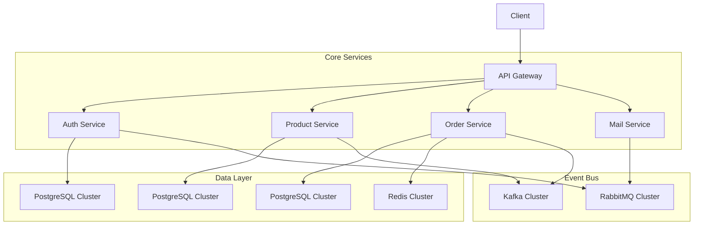
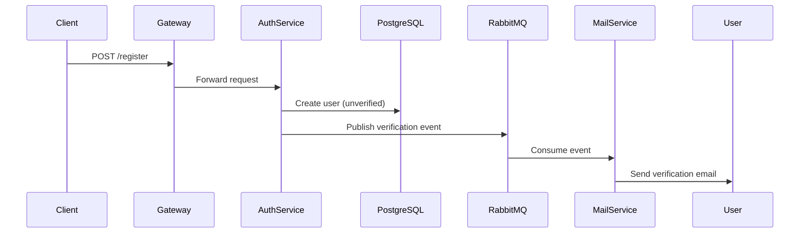
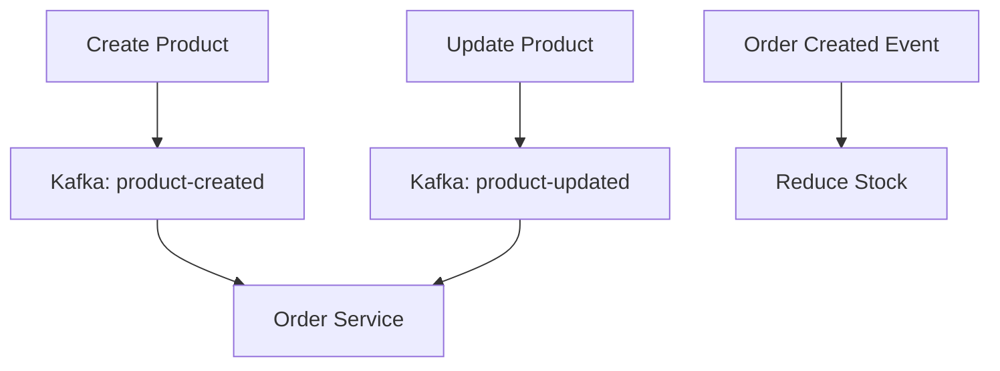
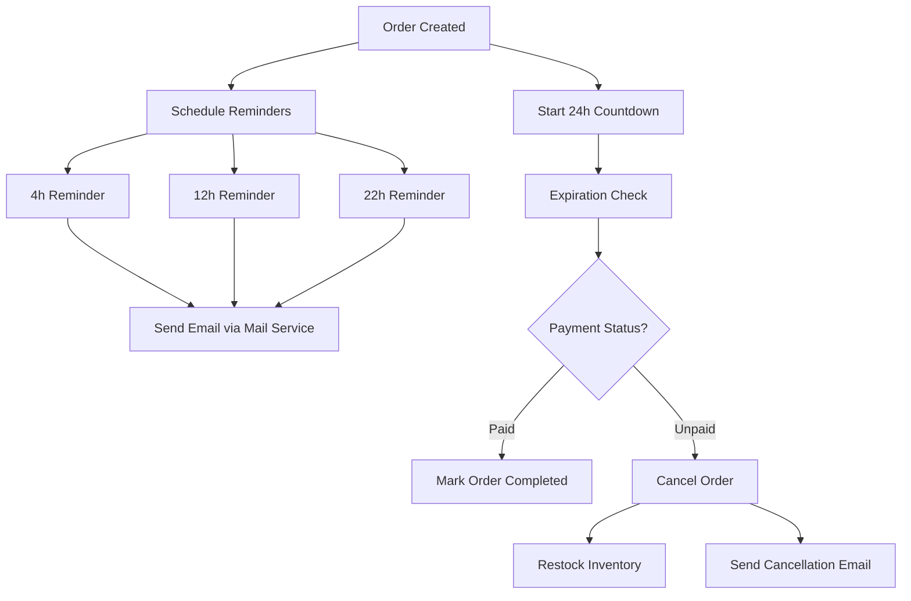
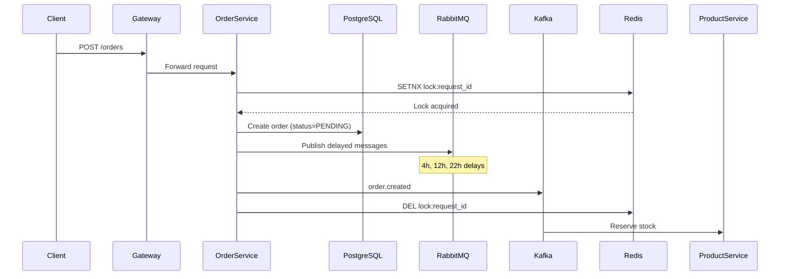
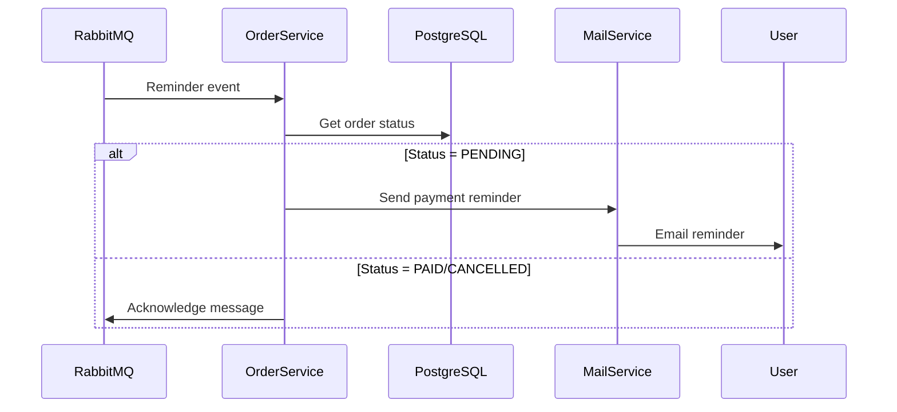
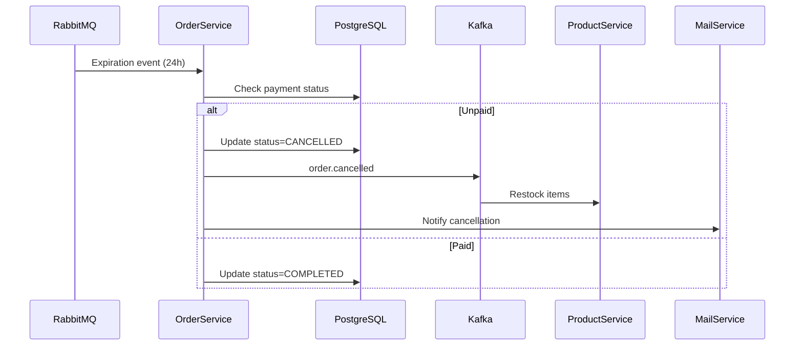
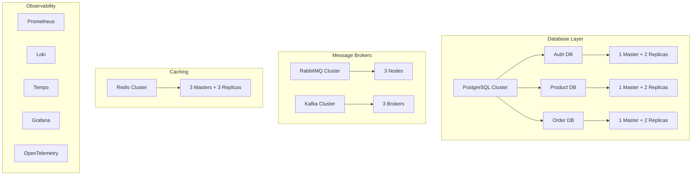
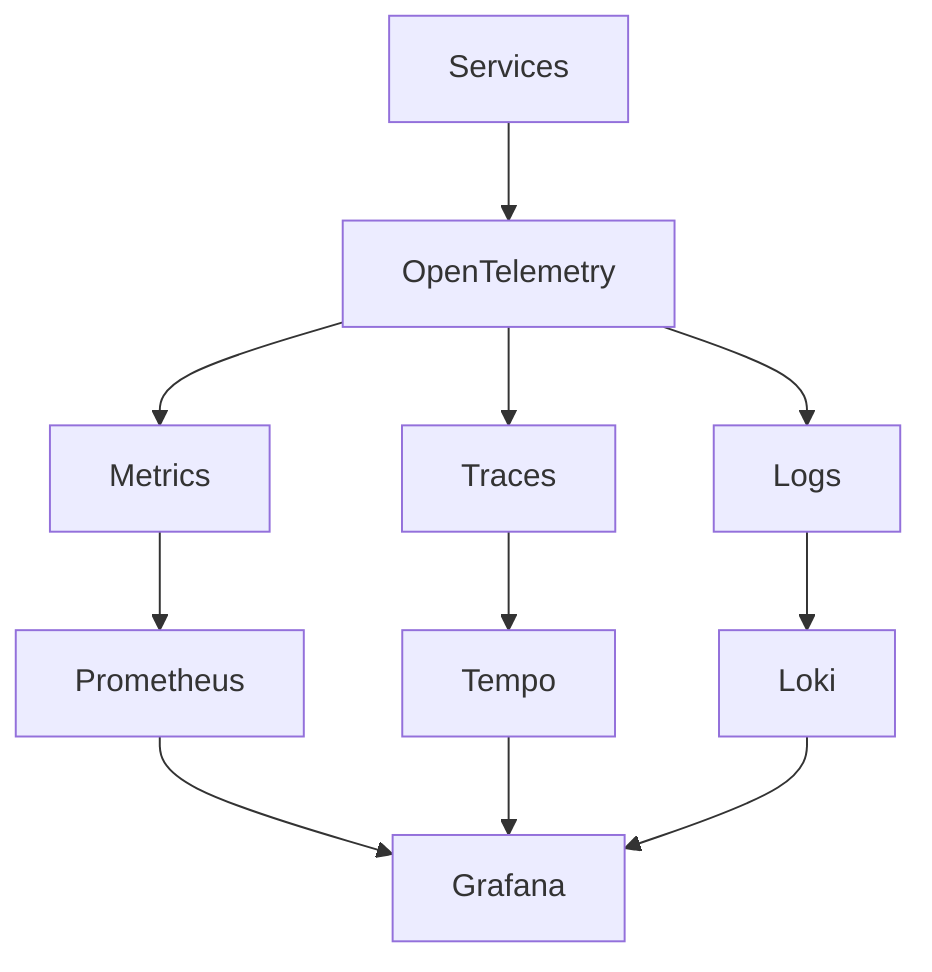
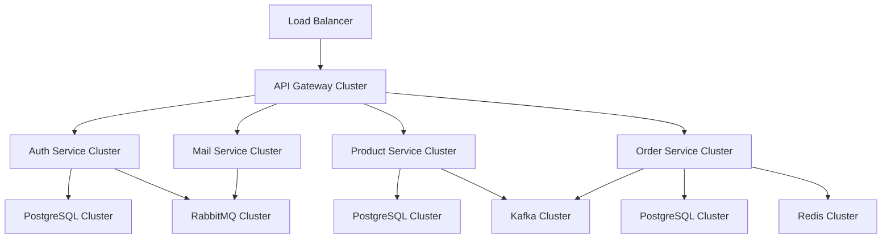

# 🚀 Go Microservices Simple E-Commerce Platform

Welcome to my journey of building a scalable microservices architecture using Golang! This project will implement core microservices patterns with modern technologies.

[](https://golang.org/)
[](https://www.docker.com/)
[](https://opensource.org/licenses/MIT)

## 📚 Docs

- [`docs/PROJECT_OVERVIEW.vi.md`](docs/PROJECT_OVERVIEW.vi.md) - Tổng quan kiến trúc, luồng chính, deployments, cách chạy
- [`docs/PROJECT_STRUCTURE.vi.md`](docs/PROJECT_STRUCTURE.vi.md) - Giải thích chi tiết từng thư mục, file và demo luồng thực tế

## ❓ How to Run

1. Clone the repository

```bash
git clone https://github.com/JordanMarcelino/learn-go-microservices.git
```

2. Start the Docker Compose

```bash
make
```

3. Check the services

```bash
docker compose ps
```

4. Import the Postman collection

5. Test the APIs

6. Stop the services

```bash
make compose-down
```

## 🌟 Key Features

- **Event-Driven Architecture** with Kafka & RabbitMQ
- **Database Master-Slave Replica** with PostgreSQL Cluster
- **Observability** with OpenTelemetry & Grafana Stack
- **Production-Grade** Infrastructure Setup

## 🏗 Architecture Overview



## 🛠 Service Breakdown

### 1. 🔐 Auth Service

**Responsibilities**: User identity management and authentication



**Key Features**:

- JWT-based authentication
- Email verification with 10-minute expiry
- Anti-spam protection (1-minute cooldown)
- CQRS pattern with master-slave replication
- Horizontal scaling with pgpool-II

---

### 2. 📦 Product Service

**Responsibilities**: Product lifecycle management



**Key Features**:

- Real-time inventory synchronization
- Event sourcing for product changes
- CQRS pattern with master-slave replication

---

### 3. 🛒 Order Service

**Responsibilities**: Order processing and fulfillment



### 1. Order Creation with Delayed Messages



### 2. Payment Reminder Execution Flow



### 3. Order Expiration Handling



## 🧠 Key Design Decisions

1. **Delayed Message Implementation**

    ```mermaid
    graph LR
      A[Order Service] -->|Publish with delay| B[RabbitMQ]
      B -->|x-delayed-message plugin| C[Delayed Exchange]
      C -->|TTL 4h| D[Reminder Queue]
      C -->|TTL 12h| E[Reminder Queue]
      C -->|TTL 22h| F[Reminder Queue]
      C -->|TTL 24h| G[Expiration Queue]
    ```

2. **State Transition Diagram**

    ```mermaid
    stateDiagram-v2
      [*] --> PENDING
      PENDING --> PAID: Payment received
      PENDING --> CANCELLED: 24h timeout
      PAID --> COMPLETED: Order fulfilled
      CANCELLED --> [*]
      COMPLETED --> [*]
    ```

**Key Features**:

- Redis distributed locking for idempotency
- Event-driven order processing
- Delayed message handling with RabbitMQ
- State transition management with PostgreSQL

---

### 4. 📧 Mail Service

**Responsibilities**: Asynchronous email processing

**Key Features**:

- RabbitMQ consumer
- Template-based email rendering
- Send retry mechanism with exponential backoff
- MailHog integration for development

---

### 5. 🌉 API Gateway

**Responsibilities**: Unified API entrypoint

**Key Features**:

- JWT validation middleware
- Rate limiting per service
- Request/Response transformation
- Prometheus metrics collection

## 🏭 Infrastructure Architecture



## 🔍 Observability Stack



**Monitoring Features**:

- Real-time service metrics
- Distributed tracing across services
- Centralized logging with labels
- Performance dashboards per service

## 🛠️ Technology Stack

**Languages & Frameworks**

- Go 1.23+
- Gin Web Framework

**Databases**

- PostgreSQL 16 with pgpool-II
- Bitnami Redis Latest Cluster

**Message Brokers**

- Bitnami Kafka Latest Cluster
- RabbitMQ 4.0 Cluster

**Infrastructure**

- Docker Swarm
- HAProxy for load balancing
- MailHog SMTP server

**Observability**

- Prometheus
- Grafana
- Loki
- Tempo
- OpenTelemetry

## 📈 Deployment Architecture


